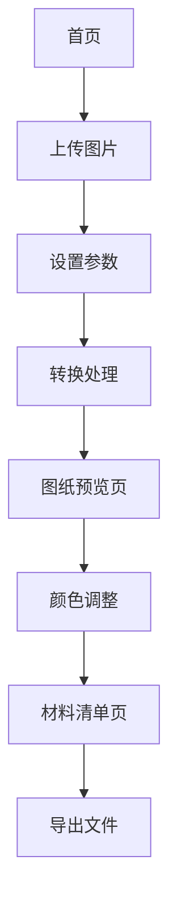

## 1. 产品概述
拼豆图纸转换器是一个在线工具，帮助手工艺爱好者将上传的图片自动转换为52×52规格的拼豆设计图纸，并提供所需色号和豆子数量的详细清单。

- 解决手工爱好者设计拼豆图案的痛点，节省手工绘图时间
- 适用于所有年龄段的手工爱好者和DIY创作者
- 提供精确的色号和数量统计，方便采购和制作

## 2. 核心功能

### 2.1 用户角色
无需用户注册，所有访问者均可免费使用基础转换功能

### 2.2 功能模块
拼豆图纸转换器包含以下核心页面：
1. **首页**：图片上传、转换参数设置、功能介绍
2. **图纸预览页**：52×52网格图纸展示、颜色调整、下载功能
3. **材料清单页**：色号统计表、豆子数量清单、导出采购单

### 2.3 页面详情
| 页面名称 | 模块名称 | 功能描述 |
|-----------|-------------|---------------------|
| 首页 | 图片上传区 | 支持拖拽或点击上传图片文件，限制文件大小5MB，支持JPG/PNG格式 |
| 首页 | 参数设置面板 | 选择颜色匹配算法（精确/近似）、设置背景透明、预览缩放比例 |
| 首页 | 转换按钮 | 开始图片转换处理，显示处理进度条 |
| 图纸预览页 | 网格展示区 | 52×52像素网格显示，每个格子2.6mm规格，支持放大缩小查看 |
| 图纸预览页 | 颜色编辑工具 | 点击格子修改颜色，提供常用拼豆色板选择 |
| 图纸预览页 | 下载功能区 | 支持下载PDF图纸、PNG图片、打印格式文件 |
| 材料清单页 | 颜色统计表 | 按色号分组统计，显示每种颜色所需豆子数量、占比 |
| 材料清单页 | 采购清单 | 生成标准采购清单，包含品牌推荐、预估价格 |
| 材料清单页 | 导出功能 | 支持Excel、PDF格式导出，便于分享和保存 |

## 3. 核心流程
用户操作流程：
1. 访问首页 → 上传图片 → 设置转换参数 → 点击转换
2. 预览生成的52×52拼豆图纸 → 必要时手动调整颜色 → 确认无误
3. 查看材料清单 → 导出采购单 → 下载图纸文件

## 4. 用户界面设计

### 4.1 设计风格
- **主色调**：明亮橙色（#FF6B35）搭配纯净白色（#FFFFFF）
- **辅助色**：温暖黄色（#FFD23F）和深灰色（#333333）
- **按钮样式**：圆角矩形，悬停效果，主要按钮使用渐变色
- **字体选择**：中文使用思源黑体，英文使用Roboto，正文字号14-16px
- **布局风格**：卡片式布局，顶部导航栏，内容区域居中显示
- **图标风格**：使用圆润的线性图标，符合手工艺术的温馨感

### 4.2 页面设计概览
| 页面名称 | 模块名称 | UI元素 |
|-----------|-------------|-------------|
| 首页 | 上传区域 | 虚线边框的拖拽区域，中央显示上传图标，支持拖拽高亮效果 |
| 首页 | 参数面板 | 卡片式分组布局，下拉选择框和滑块控件，实时预览效果 |
| 图纸预览页 | 网格展示 | 可缩放画布，网格线清晰，当前格子高亮显示，侧边色板 |
| 材料清单页 | 统计表格 | 清晰的表格布局，颜色方块预览，数量数字突出显示 |

### 4.3 响应式设计
- 采用桌面端优先设计，支持1024px以上屏幕最佳体验
- 平板端适配：调整网格大小，优化触摸操作
- 手机端：简化界面，重点突出核心功能，支持手势缩放

### 4.4 性能优化
- 图片上传前客户端压缩，减少传输时间
- 转换算法Web Worker处理，避免界面卡顿
- 图纸数据本地缓存，支持断点续传
- 懒加载技术，按需加载大规格图片