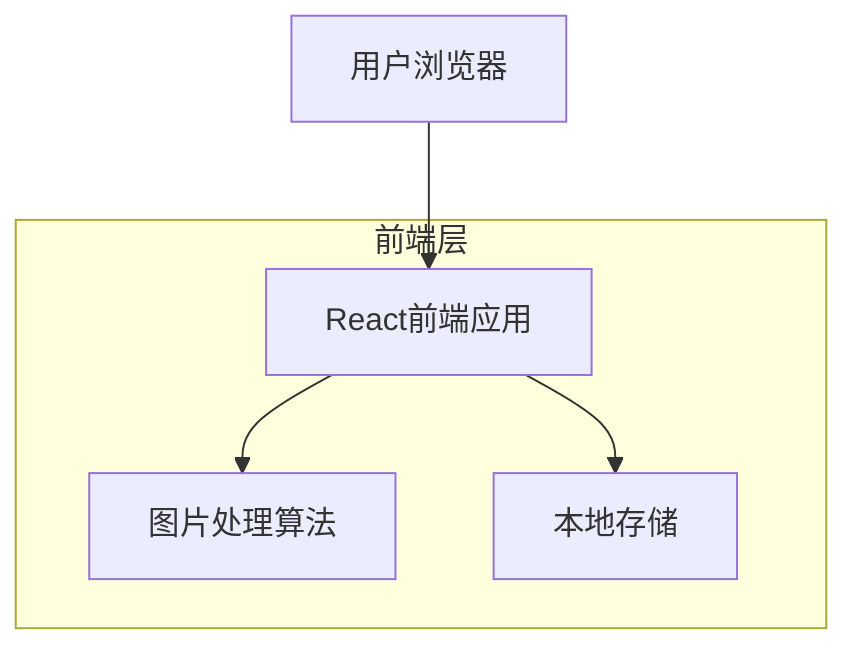

## 1. 架构设计



## 2. 技术描述

- 前端：React@18 + TypeScript + TailwindCSS@3 + Vite
- 初始化工具：vite-init
- 后端：无（纯前端应用）
- 核心依赖：
  - html2canvas：图纸导出功能
  - file-saver：文件下载
  - react-color：颜色选择器
  - jspdf：PDF生成
  - xlsx：Excel导出

## 3. 路由定义

| 路由 | 用途 |
|-------|---------|
| / | 首页，图片上传和参数设置 |
| /preview | 图纸预览和编辑页面 |
| /materials | 材料清单和导出页面 |

## 4. 核心算法实现

### 4.1 图片转换算法
```typescript
interface ConversionOptions {
  algorithm: 'precise' | 'approximate'
  transparency: boolean
  scale: number
}

interface BeadPattern {
  grid: string[][] // 52x52颜色数组
  colorStats: ColorInfo[]
}

interface ColorInfo {
  colorCode: string
  beadCount: number
  percentage: number
  name: string
}
```

### 4.2 颜色匹配算法
```typescript
// 标准拼豆颜色库
const PERLER_COLORS = [
  { code: 'P01', hex: '#FFFFFF', name: '白色' },
  { code: 'P02', hex: '#000000', name: '黑色' },
  // ... 更多颜色
]

function findClosestColor(targetHex: string): PerlerColor {
  // 使用CIE94色差公式计算最接近的颜色
  let minDistance = Infinity
  let closestColor = PERLER_COLORS[0]
  
  for (const color of PERLER_COLORS) {
    const distance = calculateColorDistance(targetHex, color.hex)
    if (distance < minDistance) {
      minDistance = distance
      closestColor = color
    }
  }
  
  return closestColor
}
```

## 5. 数据结构设计

### 5.1 本地存储格式
```typescript
interface SavedProject {
  id: string
  name: string
  originalImage: string // base64
  pattern: BeadPattern
  createdAt: number
  updatedAt: number
}
```

### 5.2 缓存策略
- 使用IndexedDB存储大型图片数据
- LocalStorage存储用户偏好设置
- SessionStorage存储当前会话数据
- 实现LRU缓存算法管理存储空间

## 6. 性能优化方案

### 6.1 图片处理优化
- Web Worker处理图片像素数据，避免阻塞主线程
- 使用Canvas 2D Context的getImageData高效获取像素
- 实现分块处理算法，支持大尺寸图片
- 使用requestAnimationFrame优化渲染性能

### 6.2 内存管理
- 及时释放大图片内存引用
- 使用虚拟滚动展示大网格
- 实现图片压缩算法减少内存占用
- 监控内存使用情况，超出阈值自动清理

## 7. 浏览器兼容性

### 7.1 支持浏览器
- Chrome 80+
- Firefox 75+
- Safari 13+
- Edge 80+

### 7.2 降级方案
- 不支持Web Worker时使用主线程处理
- 不支持IndexedDB时回退到LocalStorage
- 提供服务器端转换备选方案

## 8. 错误处理

### 8.1 图片上传错误
- 文件格式验证
- 文件大小限制检查
- 图片损坏检测
- 提供友好的错误提示

### 8.2 转换过程错误
- 算法异常捕获
- 内存不足处理
- 超时机制实现
- 自动重试逻辑